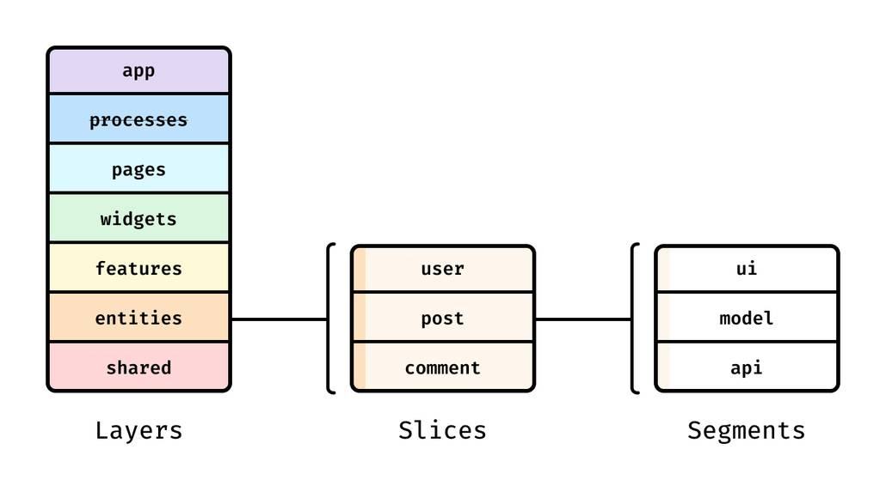

# File Structure

Project in general follows [Feature-Sliced Design](https://feature-sliced.design/) architecture with a couple of exceptions:

1. No barrel exports are used since they harm `vite` dev server performance
2. All entity definitions (schemas) and their clients (tables) are put into `shared` layer to allow cross-referencing (solution with `@x` notation mentioned [here](https://feature-sliced.design/docs/guides/examples/types#business-entities-and-their-cross-references) doesn't fit because of barrel exports absence )
