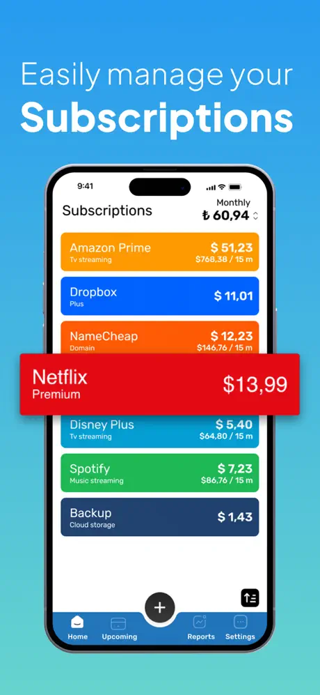
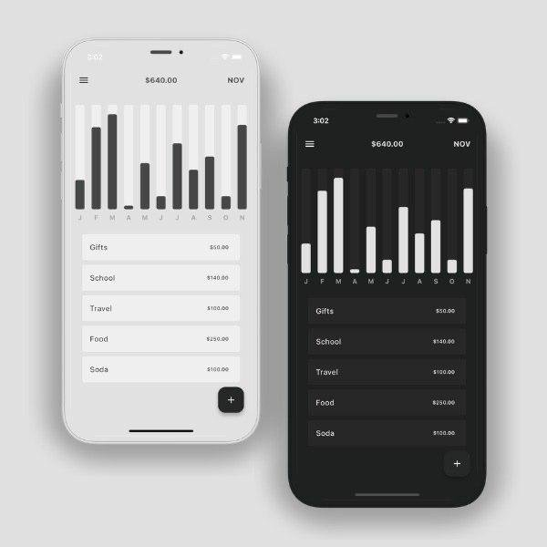

# Reference

### Bobby

[link](https://bobbyapp.co/)

###### Pros

- iCloud sync
- nice subscription creation flow, where user first chooses subscription icon/brand and only then jumps to the full list of fields to fill in
- one-time payment freemium business model
- native app experience with all the nice animations and interactions
- option to add a reminder for upcoming billing date of a subscription

###### Cons

- iOS only
- no expense visualisation like graphs and charts
- limited organizing capabilities (no nested categories)
- weird expenses calculation (if I add yearly subscription started on 01.01.2024, the app still counts it as a part of current month total expenses even when "current" month isn't January)

### Param

[link](https://www.paramapp.com/)

###### Pros

- cross-platform both mobile and desktop (beta at the moment)
- some expense visualisation with reports (beta at the moment)
- listing subs with upcoming billing dates separately to ease checking them out
- option to add a reminder for upcoming billing date of a subscription

###### Cons

- subscription-based freemium business model
- 3-rd party sync (need to create param account, can't use user-side storage like iCloud or Google Drive)
- weird expenses calculation (if I add monthly subscription started on 01.01.2024, the app counts 1/31 of its price to be daily expense in each day of month, while it is full price on 01.01 and zero on any other day of the same month)
- limited organizing capabilities (only one-to-many tags for filtering purposes)

### Random Concept from the Web

